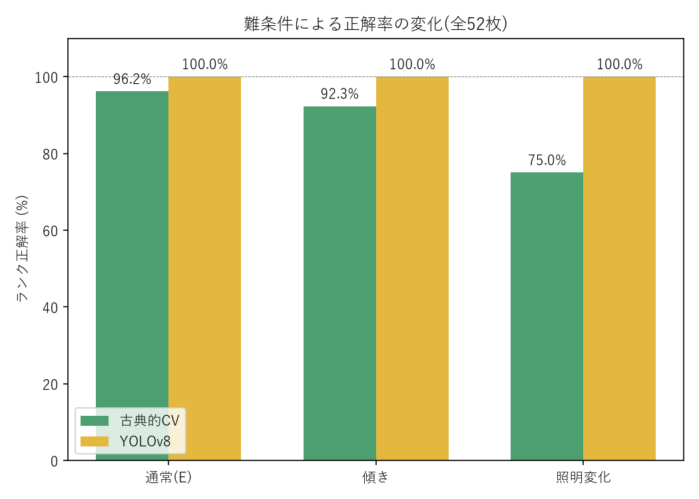
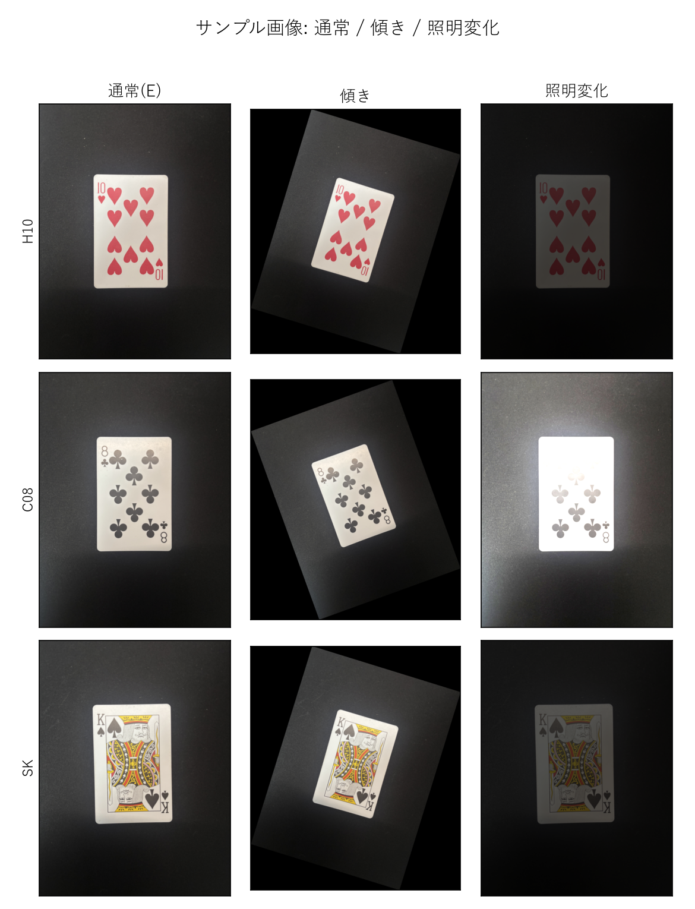
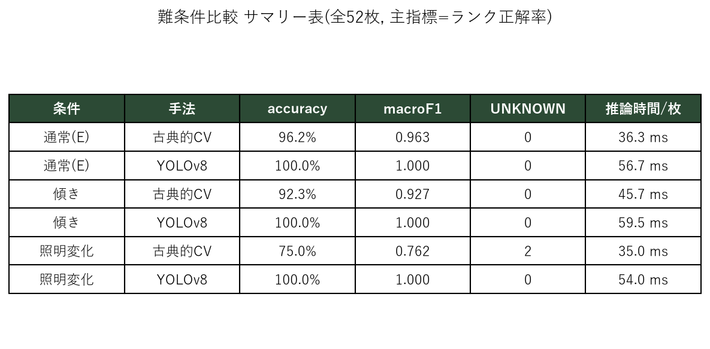

# COMPARE.md — 古典的CV手法 vs YOLOv8 比較検証 設計書

トランプの画像を判別して数字を読み取り、そこから数学的に10を導く
プロジェクトにおいて、判別部分を「OpenCVによる古典的な画像処理」と
「YOLOv8」の2手法で実装し、**同じ画像・同じ評価指標**で公平に比較検証する
ための設計と、その判断根拠を記録する。結果が出る前にこの文書を固めておく
ことで、後から指標や手順を都合よく変える(＝比較の恣意性)を防ぐ。

## §0. 訂正: 参照URLは「データセット」ではなく「学習済みモデル」

当初「YOLOv8の公開データセット」として参照した
[mustafakemal0146/playing-cards-yolov8](https://huggingface.co/mustafakemal0146/playing-cards-yolov8)
は、**データセットではなく学習済みモデル**だった。

- 実体: YOLOv8n (nano) を [Roboflow Playing Cards Dataset](https://universe.roboflow.com/augmented-startups/playing-cards-ow27d)
  (52クラスの物体検出データセット, CC0) で50エポック学習したもの
- ライセンス: MIT
- 重みファイル: `playing_cards_model_0_playing-cards-colab.pt` (6.27MB)
- 学習元データセットでの報告精度: mAP@50 = 99.5%(**同一データセット内**の数値であり、
  このプロジェクトの撮影環境での精度を保証するものではない。§6参照)

このプロジェクトでは学習は行わず、この重みをダウンロードして**推論のみ**に使う
(ゼロショット評価)。

## §1. データ設計 — TとEを分離する

画像セットを用途別に2つに分ける。

| セット | 用途 | 保存先 | 撮影 |
|---|---|---|---|
| **T** | classify.py(古典CV)のテンプレート作成**専用** | `data/template_src/` | セッション1 |
| **E** | 両手法の評価**専用**、かつ「10を作る」のランダム抽選元 | `data/deck/` | セッション2 |

**Eは、テンプレート作成にもYOLOの学習にも使わない。** これが比較の公平性の土台になる。
(YOLO側は既存データセットで学習済みのモデルをそのまま使うため元々Eを学習に
使うことは無いが、Tも同様に「評価専用画像を混ぜない」ことで、古典CV側も
YOLO側と対等に「未知の画像に対する性能」を測る土俵に揃える。)

**T と E は別の撮影セッションであること(理想は別日)。** 同日に撮る場合も、
必ず一度カードを片付けて台紙とスマホの位置をリセットしてから2周目に入ること。
並べたまま連続で撮ると、ほぼ同じ画像になり分けた意味が薄れる。

撮影・命名は `prepare_deck.py` を使う(このプロジェクト独自のツール、
`SUIT+RANK.png` 形式でファイル名がそのまま正解ラベルになる):

```
python prepare_deck.py --src data/photos_template --dst data/template_src --apply
python prepare_deck.py --src data/photos_eval      --dst data/deck        --apply
```

## §2. 共通インターフェース — 比較の公平性をコードで保証する

両手法を全く同じシグネチャの関数として実装する。

```python
def predict_rank(image_path: Path) -> str | None
```

- `classify.py`(古典的CV): `predict_rank`
- `classify_yolo.py`(YOLOv8): `predict_rank`

この2つの関数だけを知っていれば `tools/evaluate.py` を1本で共通化できる。
評価スクリプトが「どちらの手法を評価しているか」を意識する必要がなく、
比較の公平性がコードレベルで保証される。

**作業順**: `tools/evaluate.py` は `classify_yolo.py` を書く**前**に、
`classify.py` だけを対象として完成・動作確認した。評価の枠組みを先に
固定してから比較対象(YOLO)を追加する順序にすることで、「YOLOの結果に
合わせて指標や集計方法を後付けした」という疑いが生じないようにしている。

## §3. 評価指標の決定

**主指標: ランク正解率 (accuracy = 正解数 / 52)**

副指標として、クラス別 precision/recall/F1、マクロF1、平均推論時間(ms/枚)、
UNKNOWN件数も記録する。

**mAP は使わない。** 理由:

- `classify.py` (古典CV) には検出(detection)の工程が無い。常に
  「画像1枚 → カード領域1つ」という前提で背景除去→射影変換→コーナー抽出を行う。
  検出ボックスの重なり(IoU)や複数物体を評価するmAPは、そもそも定義できない。
- 比較を成立させるため、YOLO側も「1画像 → 最高信頼度の1検出 → 1ランク」に
  落とし込み、**両手法とも「画像1枚に対してランクを1つ出す分類問題」として
  統一する**。この土俵ではmAPは意味を持たないため使用しない。
- 結果として、両手法とも同じ `predict_rank(image_path) -> str | None` の
  出力を同じ方法(正解ラベルとの一致率)で採点でき、指標選択の恣意性が無くなる。

**UNKNOWNの扱い**: 古典CVがカード/ランク文字を検出できない場合と、YOLOが
検出0件の場合は、どちらも `None` を返す契約になっている。
`tools/evaluate.py` はこれを共通のUNKNOWNとして扱い、不正解の一種として
集計しつつ、件数を別途表示する(「判別を諦めた」ケースと「判別を間違えた」
ケースを区別できるようにするため)。

## §4. YOLO側の実装で注意した3点

1. **クラス名の順序**: このモデルのクラス名は `10C` `2H` `AS` のように
   `[ランク][スート]` の順(スートが末尾)。このプロジェクトのファイル命名
   `C10.png` `H2.png` (スートが先頭)とは順序が逆。`classify_yolo.py` の
   `parse_class_name()` で変換する。1桁の数字ランクは `common.RANKS` の
   命名(ゼロ埋め2桁, 例 `02`)に合わせてゼロ埋めする。このロジックは
   モデルの全52クラス名で変換結果を目視確認済み。
2. **1枚から複数検出**: トランプは左上と右下の2か所にランクが印字されて
   いるため、1枚の写真から2個の検出が返るのが普通。**最も信頼度
   (confidence)が高い検出を採用する**というルールに決めて実装した
   (`boxes.conf.argmax()`)。左上・右下の一致を要求する、平均を取る、
   といった代替ルールも考えられるが、実装の単純さと「1枚→1判定」という
   `classify.py` 側の設計に揃えるため、最高信頼度1個を採用する方式にした。
3. **検出0件の扱い**: `predict_rank` は検出0件のとき `None` を返す。
   §3で述べた通り、これは古典CV側のUNKNOWNと同じ扱いになる。

## §5. 実行方法

```
# 古典CVだけ(ultralytics不要)
python tools/evaluate.py --engine classical

# YOLOv8だけ
python tools/evaluate.py --engine yolo

# 両方比較して結果を保存
python tools/evaluate.py --engine both --save-json results/comparison.json

# 「10を作る」デモ(Eからランダム抽選)
python demo.py --engine classical
python demo.py --engine yolo
```

## §6. 結果の解釈フレーム(実験前に固定する)

このYOLOv8モデルは学習元データセット上でmAP@50=99.5%と報告されているが、
それは**同じデータセット内**での数値である。このプロジェクトの撮影環境
(カードのデザイン、背景の黒クロス、照明、スマホのカメラ)は学習データと
異なるため、ドメインギャップで精度が落ちる可能性がある。
結果がどちらに転んでも、以下のように解釈できるようにしておく。

### パターンA: YOLOv8(ゼロショット)が古典CVと同等以上の精度を出した場合

- 「大規模な公開データセットで学習済みのモデルは、多少の環境差
  (カードのデザイン・背景・照明)を吸収して汎化できる」という結論になる。
- 古典CV(テンプレートマッチング)は**T セットに強く依存する**ため、
  T の枚数・撮影条件が理想的でない場合に相対的に不利になりやすい。
- この場合の実用上の含意: 自分で大量の教師データを用意できないなら、
  既存の学習済みモデルを流用する方が費用対効果が高い。

### パターンB: YOLOv8(ゼロショット)が古典CVより明確に精度が低い場合

- 「学習データセットと実運用環境のドメインギャップ」が可視化された、
  という結論になる。具体的な要因の候補:
  - カードの意匠(バックデザイン、フォント、インデックスの位置)が
    Roboflowデータセットのカードと異なる
  - 背景(黒クロス)や照明がRoboflowデータセットの撮影条件と異なる
  - 撮影距離・カード1枚あたりの写り方(全体 vs 一部)の違い
- 古典CV側はTセットを**同じ撮影環境**で作るため、環境依存のノイズを
  ある程度吸収できる。「少量でも自分の環境に合わせたテンプレート/教師データ
  の方が、大規模でも異なる環境の学習済みモデルより強い場合がある」という、
  ドメイン適応の重要性を示す結果になる。

### いずれの場合も

- UNKNOWN件数を別途確認し、「間違えた」のか「判別自体を諦めた」のかを
  区別して報告する。
- クラス別precision/recall/F1を見て、特定のランク(例: 装飾の多い絵札)
  だけが弱いのか、全体的に弱いのかを切り分ける。
- 推論速度(ms/枚)は精度とは独立した軸として併記する
  (精度で劣っても速度で優位、というケースもありうる)。

## §7. 既知の制約

- Tのカード1種類につきサンプル枚数が少ない場合、テンプレートの頑健性が
  下がる(古典CV側の弱点)。
- YOLO側はこのプロジェクトの画像では一切学習していないため、
  ドメインギャップの影響を直接受ける(§6参照)。
- 古典CV(`classify.py`)はカードがほぼ正立(90°/180°回転なし)で
  撮影されている前提。
- 古典CV(`classify.py`)の背景分離は、当初HSVによる緑色抽出で設計したが、
  実際の撮影環境は黒クロス背景だったため、グレースケール化+Otsu二値化に
  よる輝度ベースの分離に変更した(「背景は暗色・カードは明色」という前提)。
  色ではなく明度で分離するため、黒に限らず暗色の背景全般に対応できるが、
  背景とカードの明度差が小さい場合(強い影・反射・暗色のカード等)は
  分離に失敗しやすい点は変わらず残る制約である。

## §8. 最終結果(本番T・Eによる評価, 2026-08-30実施)

`data/template_src/`(T)・`data/deck/`(E)ともに52枚(数札40+絵札12)を
別撮影セッションで用意し、`tools/evaluate.py --engine both` を実行した結果
(`results/comparison.json` に生データを保存)。

| 手法 | accuracy | macro F1 | UNKNOWN | 平均推論時間 |
|---|---|---|---|---|
| classify(古典CV) | 0.962 (50/52) | 0.963 | 0/52 | 36.3 ms/枚 |
| classify_yolo(YOLOv8) | 1.000 (52/52) | 1.000 | 0/52 | 56.7 ms/枚 |

### §8.1 誤答2件の原因調査(古典CVのみ)

誤答2件はいずれも `Q` に誤判定されていた(`C08`→`Q`, `CK`→`Q`)。
`tools/debug_misclassified.py`(中間処理を画像化し、全13ランクとの
類似度スコアを表示する診断スクリプト)で原因を特定した
(生成画像は `debug_out/C08/`, `debug_out/CK/`)。

**原因: コーナーの「ランク行」と「スート行」を分離する行クラスタリングが、
まれに両方を1つの塊としてマージしてしまう。**

`extract_rank_glyph()` は、コーナー内の文字の輪郭をy座標でソートし、
直前の行の最下端 + `ROW_GAP_TOL`(=6px、許容ギャップ)以内なら同じ行と
みなしてまとめる方式で「ランク(上段)」と「スート記号(下段)」を分離
している。ところが:

- `C08`: ランク`8`の下端と、コーナー右端付近の小さなノイズ片(印刷の
  にじみ等、幅7px)の隙間がちょうど`ROW_GAP_TOL`と同じ6pxだったため
  「同じ行」と誤判定 → そのノイズ片経由でスート記号(♣)まで連鎖して
  1つの塊にマージされた。
- `CK`: ランク`K`の下端とスート記号(♠)の上端の隙間が、たまたま
  `ROW_GAP_TOL`と同じ6pxちょうどだったため直接マージされた。

その結果、本来「ランク文字だけ」のはずの比較対象(グリフ)が
「ランク文字+スート記号」の合成画像になり、正解ランクのテンプレート
(ランク単体の形)とは似ても似つかない形になっていた。一方でテンプレート
`Q`はT側の作成時にたまたま同様のマージが起きて「Q+スート記号」の合成
画像になっていたため、「合成画像どうし」の形状的な類似度(matchTemplateの
正規化相互相関)がたまたま高くなり、`Q`が最有力候補に選ばれていた
(`debug_out/C08/07_side_by_side.png` にクエリ/正解テンプレート/誤答
テンプレートの3枚並び画像がある)。

なお、これは52枚中50枚では起きておらず、「印刷のわずかなにじみ・ノイズ片
の位置」と「固定ピクセル閾値でのgap境界値判定」がたまたま重なったときに
だけ発生する、再現条件の狭い挙動だった(＝この2枚固有の癖であり、他の
クラブスートのカードや、8・Kという数字自体に一般的な弱点がある訳ではない)。
今回はコードは変更せず、原因の可視化・特定のみを行った。
`ROW_GAP_TOL` を小さくする、あるいは行分割を投影プロファイルの谷検出に
置き換える、といった対策は考えられるが未着手。

### 解釈(§6のフレームに沿って)

**パターンAに該当**: YOLOv8(ゼロショット、このプロジェクトの画像では
未学習)が古典CV(このプロジェクトの環境で作ったT専用テンプレート)と
同等以上——今回はむしろ上回る——精度を達成した。

- 大規模公開データセットで学習済みのYOLOv8は、黒クロス背景・このカードの
  意匠・スマホのカメラという環境差を吸収して汎化できた。
- 古典CVはテンプレートマッチングという性質上、コーナー抽出時の細かい
  ノイズに弱く、♣スートの2枚で取り違えが発生した(§8.1)。
- 実用上の含意: 今回の規模(52枚)・環境では、自前でテンプレートを
  作るコストに対して、既存の学習済みモデルを流用する方が精度・費用対効果
  ともに優れていた。ただし古典CV側もUNKNOWN 0件・96.2%と実用に耐える
  水準ではあり、「大量の教師データが用意できない場合の次善策」としては
  十分機能している。
- 推論速度は古典CVが約1.6倍速い(36.3ms vs 56.7ms)。リアルタイム性を
  重視する用途では、精度差(3.8ポイント)とのトレードオフとして考慮する
  価値がある。

## §9. 難条件テスト(傾き・照明変化)

E(52枚)を正解ラベルはそのままに画像処理で加工し、2種類の難条件セットを
合成した(新規撮影ではなく、既存Eの合成加工。`tools/make_stress_tests.py`,
乱数シード固定で再現可能)。Tは変更せず、通常条件のまま。

| セット | 内容 | 保存先 |
|---|---|---|
| 傾き | 画像全体を±10°〜22°回転(はみ出す分は黒で拡張) | `data/deck_tilt/` |
| 照明変化 | 明るさを0.3〜0.5倍(暗め)または1.7〜2.1倍(明るめ)+ガンマ jitter | `data/deck_light/` |

`tools/evaluate.py --engine both --deck-dir data/deck_tilt` などで通常のE
と同じ指標で評価し、`tools/report_stress_tests.py` で結果を画像化した
(`results/stress_test/`)。







### 結果

| 条件 | 古典CV accuracy | YOLOv8 accuracy |
|---|---|---|
| 通常(E) | 96.2% (50/52) | 100.0% (52/52) |
| 傾き | 92.3% (48/52) | 100.0% (52/52) |
| 照明変化 | **75.0% (39/52)**, UNKNOWN 2件 | 100.0% (52/52) |

### 解釈

- **YOLOv8はどの条件でも100%を維持**した。学習元(Roboflow Playing Cards
  Dataset)自体に多様な角度・照明のサンプルが含まれているため、傾きや
  露出の変化に対して頑健だと考えられる。
- **古典CVは条件が厳しくなるほど明確に精度が落ちた**、特に照明変化で
  75.0%まで低下し、UNKNOWN(検出不能)も2件発生した。原因は設計上の
  前提が崩れるため:
  - 傾き: `extract_card()` は `minAreaRect` で傾きを補正できるが、
    補正誤差や射影変換のわずかなズレがコーナー切り出し位置をずらし、
    ランク文字の一部欠けや隣接ノイズの混入を招きやすくなる。
  - 照明変化: 背景/カードの分離、およびコーナー内の文字の二値化は
    どちらも **Otsu二値化(画素値の分布から自動でしきい値を決める)**
    に依存している。露出不足/過多で画素値の分布そのものが偏ると、
    Otsuが選ぶしきい値が最適でなくなり、カード領域を取り違えたり
    (UNKNOWNの原因)、文字が潰れる/薄れる(誤判定の原因)。
- **まとめ**: 通常条件では古典CVも96%超と実用的だが、大規模データで
  学習済みのYOLOv8の方が撮影条件の変化に対して明確に頑健である。
  古典CVの頑健性を上げるには、Otsu二値化を適応的二値化(ブロックごと)
  に置き換える、露出補正を前処理に挟む、といった対策が考えられるが
  未実装(今回はコードを変更せず、通常条件のパイプラインのまま難条件を
  評価した)。
